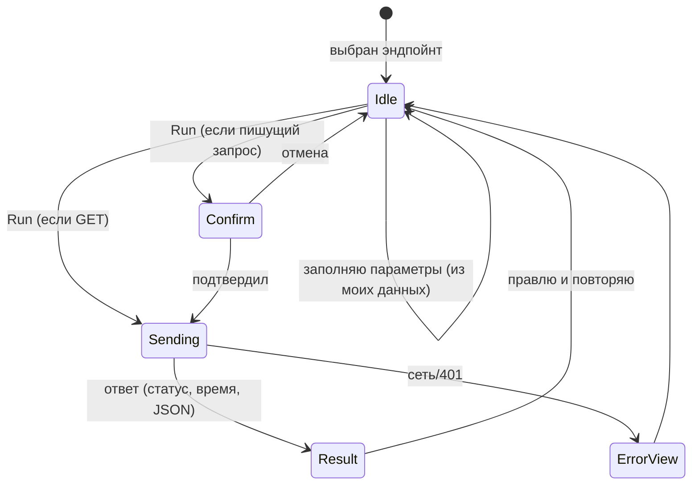
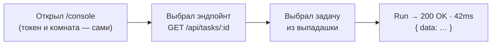

# Bulut Console («Живая консоль») — дизайн

## 1. Проблема (переформулировка)

Нужен **быстрый способ проверять и «щупать» backend Bulut из самого приложения**.
Swagger описывает схему, но заставляет вручную вводить токены и UUID. Postman —
внешний, ручная авторизация, ручные id, отдельная синхронизация. Оба «дорогие» на
каждый запрос.

**Реальная задача:** убрать рутину (авторизация + подстановка id), чтобы проверить
любой эндпойнт было **2 клика, а не 5 минут настройки** — и чтобы при этом нельзя
было случайно сломать боевые данные.

Кто пользуется: владелец/админ проекта и разработчик (сам пользователь).

## 2. Рекомендуемый подход и почему

Встроенная страница **`/console`** внутри Bulut, которая берёт **твою текущую
сессию** и **твои реальные данные из стора** — поэтому и авторизация, и id
подставляются сами.

Ключевой размен: **не строим ничего на бэкенде и в БД.** Консоль — чисто клиентская
страница поверх уже существующего REST API. Она физически не может сделать больше,
чем ты и так можешь в приложении (всё через тот же токен и RLS). Это и просто, и
безопасно.

_Рассмотрено и отклонено:_
- **Swagger UI (`swagger-ui-react`)** — генерит форму из OpenAPI, но не знает твоих
  данных и требует ручной токен. Та же боль, что бесит.
- **Отдельный сервис/прокси для тестов** — лишний слой, авторизация, деплой. Не
  оправдан для ~15 эндпойнтов.

## 3. Контекст (как ложится на проект)

Всё нужное уже есть — новый код только на фронте:

| Что нужно консоли | Что уже есть в Bulut |
|---|---|
| Токен без копипаста | Пользователь залогинен → `supabase.auth.getSession()` отдаёт `access_token` прямо в браузере |
| Реальные доски/задачи/карты | `useStore()` (boards, tasks, maps, journal) уже в памяти |
| Комнаты + заголовок | `useWorkspace()` (activeId, список) → `X-Workspace-Id` |
| Каталог эндпойнтов | `GET /api` уже отдаёт список; REST-роуты `/api/*` готовы |
| Единый формат ответа | `{ data } | { error }` |

Итог: **ни миграций, ни таблиц, ни новых роутов.** Только страница + статический
каталог эндпойнтов.

## 4. Актёры и права

- **Владелец / админ** — видят пункт «Консоль» в Sidebar (это power-tool).
- Технически консоль не даёт лишних прав: она шлёт запросы **твоей** сессией, RLS
  режет всё как обычно. Поэтому доступ гейтим просто по `admin.access` (чтобы не
  захламлять интерфейс обычным участникам), а не отдельным сложным правом.

## 5. Данные (без БД)

Единственная «модель» — **статический каталог эндпойнтов** в коде (массив
объектов). Каждый параметр знает свой источник — по нему UI рисует нужный контрол:

```
Endpoint {
  method: GET | POST | PATCH | DELETE
  path:   "/api/tasks/:id"
  danger: false            // GET — безопасно; write — true
  params: [                // :id, ?query
    { name: "id", in: "path", source: "task" }      // → выпадашка задач
  ]
  body?: [                 // для POST/PATCH
    { name: "title",     source: "text" },
    { name: "boardId",   source: "board" },          // → выпадашка досок
    { name: "columnId",  source: "column" },         // → колонки выбранной доски
    { name: "type",      source: "enum", options: ["task","bug","feature"] }
  ]
}
```

`source` → контрол:
- `board / task / map / workspace` → выпадашка из `useStore()`/`useWorkspace()` с
  человекочитаемым названием (а внутри — реальный id);
- `column` → зависимая выпадашка (колонки выбранной доски);
- `enum` → кнопки/селект; `text / number / json` → поле ввода.

## 6. Логика и состояния



Инварианты:
- **По умолчанию «Только чтение»** — пишущие эндпойнты выключены (серые). Снимаешь
  галочку осознанно.
- Любой **POST/PATCH/DELETE** — красный и просит подтверждение.
- `X-Workspace-Id` всегда явно проставлен из выбранной комнаты (видно в UI).

## 7. Пользовательский поток (happy path — 3 шага)



Ветки:
- Пишущий запрос → между «Run» и ответом вставляется подтверждение.
- 401 (сессия протухла) → подсказка «обнови страницу» (supabase сам рефрешит).
- Ошибка валидации от API → показываем `{ error }` как есть.

Рядом с ответом — кнопки **Copy as curl** и **Copy as fetch** (сгенерим из текущего
запроса), чтобы унести наружу.

## 8. Архитектура

```mermaid
flowchart LR
    subgraph Браузер (уже залогинен)
      P["Страница /console"] --> S["useStore / useWorkspace<br/>(доски, задачи, карты, комната)"]
      P --> T["supabase.auth.getSession()<br/>→ access_token"]
      P --> CAT["Каталог эндпойнтов<br/>(статический массив)"]
    end
    P -->|"fetch: Authorization + X-Workspace-Id"| API["Существующие /api/* роуты"]
    API -->|"RLS по твоей сессии"| DB[(Supabase)]
```

Ноль нового бэкенда. Страница собирает запрос из каталога + твоих данных + токена и
бьёт по уже существующим роутам.

## 9. Проверка на простоту (что осознанно НЕ делаем)

- ❌ Никаких изменений на сервере, в БД, миграций.
- ❌ Не генерим OpenAPI-схему автоматически — для ~15 эндпойнтов ручной каталог
  честнее и точнее (знает, какой параметр из какой сущности брать).
- ❌ Не делаем свой логин — используем уже открытую сессию.
- ❌ Не тащим внешние либы (Swagger UI и т.п.) — своя лёгкая страница.

## 10. Что может пойти не так (пре-мортем)

| Риск | Поведение |
|---|---|
| Случайный DELETE по боевой задаче | «Только чтение» по умолчанию + красное подтверждение; `?hard=true` прячем за доп. галочкой |
| Токен протух посреди сессии | supabase авто-рефреш; при 401 — явная подсказка обновить |
| Не та комната | Пикер комнаты вверху, выбранный `X-Workspace-Id` показан в запросе |
| Огромный ответ (сотни задач) | JSON сворачиваем/ограничиваем высоту, «показать всё» по клику |
| Устаревшие выпадашки (создал через API — в сторе нет) | Кнопка «обновить данные» (`refetch()` уже есть) |
| Обычный участник увидел консоль | Гейт по `admin.access` в Sidebar |

## 11. Фазы

- **Фаза 1 — ядро (один заход):** страница `/console` + пункт в Sidebar (по
  `admin.access`); токен из сессии; пикер комнаты; каталог эндпойнтов; data-aware
  выпадашки (доска/задача/карта/колонка/enum); **Run** → статус + время + красивый
  JSON; цвет по безопасности + «только чтение» по умолчанию + подтверждение на
  запись; **Copy as curl / fetch**.
- **Фаза 2 — удобство:** история запросов (последние N в localStorage);
  сохранённые запросы («избранное»); **сценарии-цепочки** (создать → изменить →
  перенести, id из шага прокидывается в следующий).
- **Фаза 3 — экспорт наружу:** генерация коллекции Postman / OpenAPI-файла (для
  тех, кому реально надо во внешний инструмент); подсветка синтаксиса; сравнение
  двух ответов (diff).

**Оценка Фазы 1:** сопоставима с одним разделом среднего размера — делается за один
заход, целиком на фронте.

## 12. Вопросы на согласование

1. **Доступ:** прячем консоль под `admin.access` (владелец/админ)?
   ✅ Рекомендую да — это инструмент для владельца/разработчика.
2. **Безопасность по умолчанию:** режим «Только чтение» включён при входе, запись —
   через снятие галочки + подтверждение. Ок? ✅ Рекомендую именно так.
3. **Объём сейчас:** делаем **Фазу 1** (ядро), а цепочки/историю/экспорт — потом?
   ✅ Рекомендую Фазу 1 — она уже закрывает «проверить любой эндпойнт в 2 клика».
4. **Название/иконка:** «Консоль» с иконкой терминала в Sidebar — норм, или другое имя?
