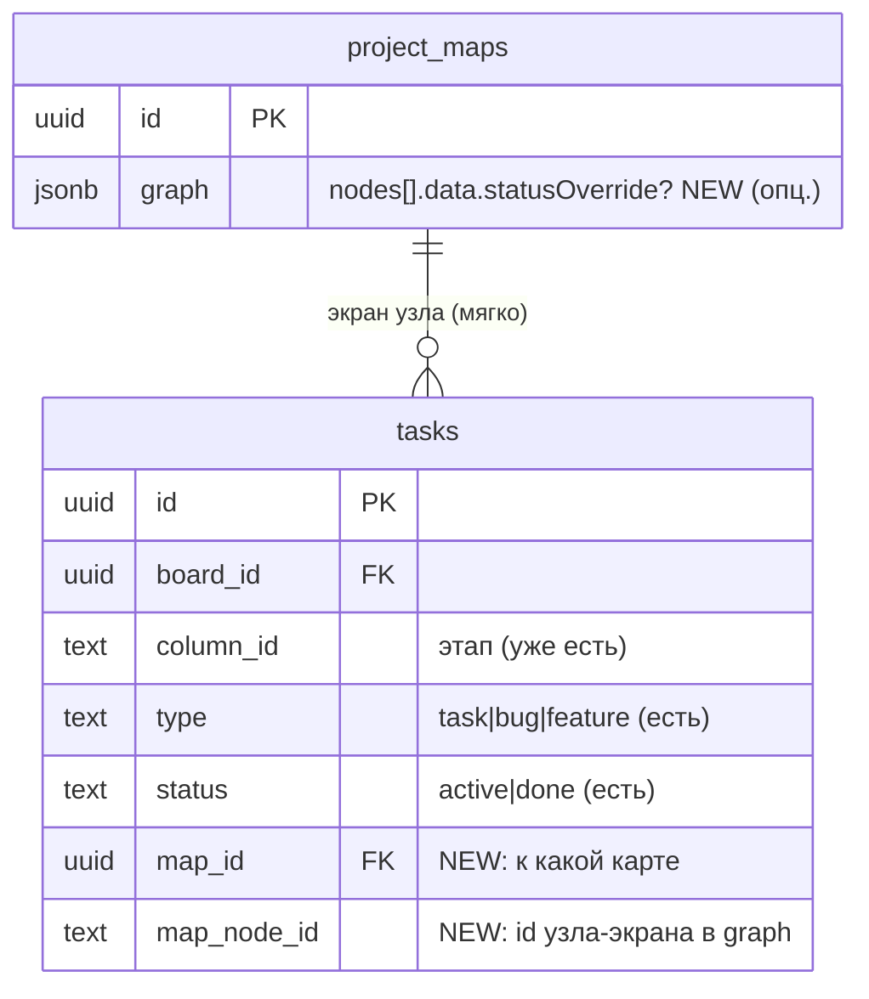
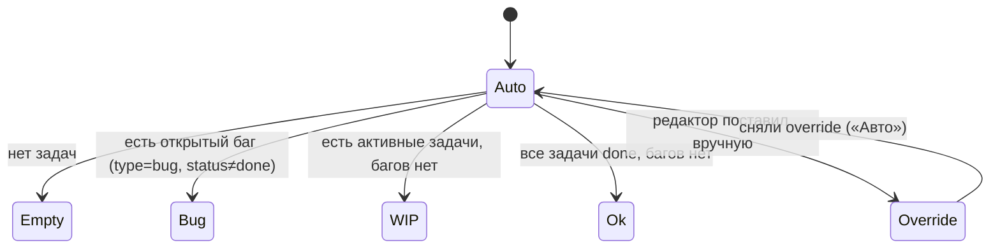
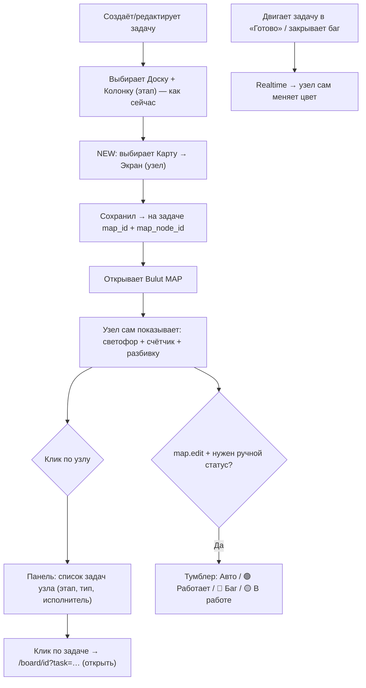
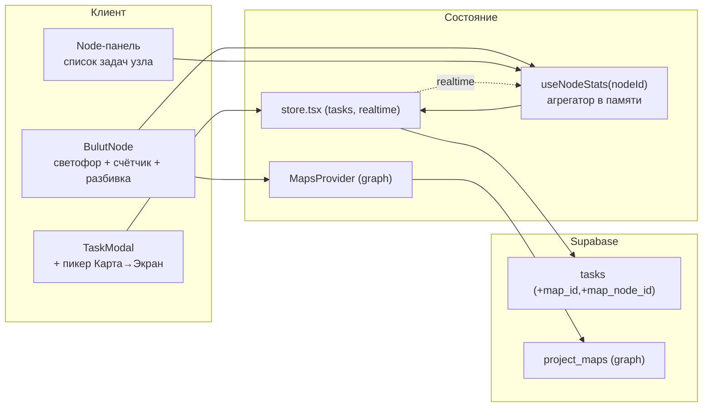

# Bulut MAP × Доски — «живая» карта проекта · Дизайн

> Только проектирование. Согласуем — потом строим.

## 1. Проблема (переформулировка)

Карта проекта («Driver» с экранами и этапами) и реальная работа (доски/задачи) живут
**отдельно**. Пользователь хочет, чтобы карта стала **живой панелью состояния**: каждый
экран/узел показывал, **сколько задач** к нему привязано, **на каких этапах** они, и
**всё ли работает или есть баги** — красным/зелёным. И чтобы задачу можно было создать
сразу «на такой-то экран».

**Кому служит:** команде и владельцу — одним взглядом на карту видно здоровье продукта:
где кипит работа, где баги, где вообще ничего не сделано.
**Успех:** привязал задачу к экрану за 2 клика → на карте узел сам показал счётчик и
светофор; открыл баг → узел покраснел; закрыл → позеленел. Реалтайм, красиво, точно.

## 2. Рекомендуемый подход и почему

**Связь храним на ЗАДАЧЕ** (2 новых поля: `map_id`, `map_node_id`), а статус узла
**агрегируем на лету** из задач. Граф карты (JSONB) при этом не трогаем на каждый чих —
он часто меняется, и держать в нём ссылки на задачи = ад синхронизации. «Этап» отдельно
не вводим: у задачи уже есть `column_id` — это и есть её этап на доске.

Статус узла = **светофор**, выводимый из привязанных задач, с возможностью **ручного
override** (флажок в узле): 🔴 есть открытый баг · 🟡 есть活 работа · 🟢 всё готово/работает ·
⚪ нет задач. Реалтайм берём бесплатно: задачи уже в `store.tsx` с realtime, карта их читает.

Альтернативы (отклонены, 1 строкой):
- **Хранить задачи-ссылки в JSONB узла** — рассинхрон при каждом редактировании графа.
- **Отдельная таблица-связка task↔node** — избыточно, хватает двух колонок на задаче.
- **Дублировать «этап» в связь** — не нужно, `column_id` задачи уже = этап.

**Ключевой компромисс:** агрегация статуса считается в памяти из общего списка задач
(не в БД). Для масштабов внутренней команды — мгновенно; при тысячах задач на карту
добавим индекс/выборку по `map_id` (см. пре-мортем).

## 3. Контекст (как ложится на проект)

| Нужное | Что есть в Bulut | Как используем |
|---|---|---|
| Задачи с этапом, типом, статусом | `tasks` (`column_id`=этап, `type` вкл. `bug`, `status`) | Добавляем 2 колонки-ссылки на карту/узел |
| Карта с узлами | `project_maps.graph` (JSONB, узлы React Flow, стабильные `id`) | Узел агрегирует задачи по `map_node_id` |
| Реалтайм и общий стор | `store.tsx` (tasks realtime), `MapsProvider` | Карта читает `useStore().tasks` → живые индикаторы |
| Форма задачи | `TaskModal` (поля: колонка, тип, …) | Добавляем пикеры «Карта → Экран» |
| Права | `permissions.ts` (`map.view/edit`, `card.*`) | Просмотр статусов — `map.view`; ручной статус — `map.edit` |
| Узлы карты | `BulutNode.tsx` (kind screen/action/decision/…) | Рисуем бейдж-светофор + счётчик + разбивку |

## 4. Актёры и роли

- **Автор задачи** (`card.create/edit`) — привязывает задачу к карте/экрану.
- **Смотрящий карту** (`map.view`) — видит светофоры, счётчики, список задач узла.
- **Редактор карты** (`map.edit`) — ставит ручной override статуса узла.
- Владелец/админ — всё.

## 5. Модель данных

- **`tasks.map_id`** (uuid, nullable, FK `project_maps` `on delete set null`) — какая карта.
- **`tasks.map_node_id`** (text, nullable) — id узла в графе карты (у узлов стабильные uuid).
- **Ручной статус** — необязательное поле в узле: `node.data.statusOverride ∈ {ok, bug, wip}`
  (или отсутствует = «авто»). Живёт в том же `graph` JSONB (меняется редко, руками).

Связь с узлом — **мягкая** (просто id): если узел/карту удалили, задача не ломается
(см. пре-мортем).

## 6. Логика статуса узла (светофор)

Правила агрегации для узла N (карта M):
- `linked = tasks[ map_id=M и map_node_id=N.id ]`
- если у узла есть `statusOverride` → он и есть цвет (🟢 ok / 🔴 bug / 🟡 wip);
- иначе **авто**:
  - 🔴 **Баг** — есть `linked` с `type='bug' && status!='done'` (открытый баг);
  - 🟡 **В работе** — есть `linked` с `status!='done'` (и нет открытых багов);
  - 🟢 **Готово** — есть `linked`, все `done`, багов нет;
  - ⚪ **Пусто** — `linked` пуст.
- **Счётчик** — `linked.length` (и отдельно активных).
- **Разбивка по этапам** — группировка `linked` по `column_id` доски (К выполнению / В
  процессе / Готов к тестированию / На проверке / Готово) → мини-полоска/точки.

## 7. Пользовательский поток

Путь привязки: **создать задачу → выбрать карту+экран = +1 шаг**. Просмотр — 0 действий
(узлы уже подсвечены).

## 8. Архитектура

Ключ: `NODE`/`PANEL` берут задачи из уже-реалтаймового `store`, статус считает маленький
хук `useNodeStats(mapId, nodeId)`. Никаких новых серверных сервисов.

## 9. Проверка на простоту — что НЕ делаем

- **Не вводим отдельный «этап»** — это `column_id` задачи.
- **Не храним задачи в JSONB** — агрегируем из `tasks`.
- **Не делаем таблицу-связку** — двух колонок хватает.
- **Ручной override** — опционально (Фаза 2), по умолчанию всё авто.
- **Не считаем статус в БД/через триггеры** — в памяти из стора (realtime и так есть).

## 10. Что может пойти не так (пре-мортем)

| Риск | Поведение по задумке |
|---|---|
| Узел удалён из карты, а задачи на него ссылаются | Агрегация просто игнорирует (узла нет). На задаче показываем «экран удалён», даём перепривязать. |
| Карта удалена | FK `set null` → `tasks.map_id=null`, задача цела, связь снята. |
| Задача перенесена на другую доску | `map_id/map_node_id` остаются; при желании чистим в UI. Не критично. |
| Много задач/карта большая | Агрегация O(tasks) в памяти — ок до тысяч. При росте: выборка `tasks` по `map_id` + мемоизация; индекс `idx_tasks_map (map_id)`. |
| Нет прав `map.edit`, но жмёт ручной статус | Кнопка скрыта; сервер (RLS project_maps update) отклонит. |
| Два пользователя правят статус узла разом | JSONB last-write-wins + realtime (как сейчас в картах). |
| Экран без задач | ⚪ серый + пунктир «нет задач» — видно «мёртвые» зоны (это фича). |

## 11. Крутые фишки (сверх базы)

- **«Здоровье флоу»** — плашка сверху карты: % зелёных экранов, всего открытых багов,
  экраны без задач. Одним взглядом — состояние продукта.
- **Обводка узла по статусу** (не только точка) + мягкий **пульс** у красных.
- **Мини-прогресс** на узле: полоска `done/total`.
- **Клик → drawer задач** узла с кнопкой **«+ Задача на этот экран»** (создаётся сразу
  привязанной).
- **Обратная ссылка на задаче**: «Экран: OTP (карта Driver)» → переход на карту с
  **фокусом/подсветкой** узла (`/maps/[id]?focus=nodeId`).
- **Фильтры карты**: показать только 🔴 / только с открытыми багами / только пустые.
- **Экспорт «карты здоровья» PNG** — готовый статус-отчёт (у нас уже есть экспорт PNG).
- **MCP-инструменты**: `link_task_to_node`, `node_health` — Claude привязывает задачи и
  отвечает «что красное на карте Driver».

## 12. Фазы

- **Фаза 1 — MVP (связь + светофор):** миграция (`tasks.map_id`, `map_node_id`, FK, индекс);
  пикеры **Карта → Экран** в `TaskModal`; на узле **светофор (авто) + ручной override + счётчик**,
  реалтайм; клик по узлу → **список задач** с переходом на доску. Права `map.view` (смотреть),
  `map.edit` (ручной статус). _[решено: авто+ручной сразу; один экран на задачу]_
- **Фаза 2 — управление и наглядность:** ручной **override статуса** (тумблер, `map.edit`);
  **разбивка по этапам** на узле; **«+ задача на экран»**; **обратная ссылка** на задаче +
  фокус узла; фильтры 🔴/баги/пустые; плашка **«Здоровье флоу»**.
- **Фаза 3 — вау:** пульс/обводка, экспорт карты здоровья, MCP-инструменты, авто-подсказка
  сопоставления экранов ↔ колонок.

**Оценка Фазы 1:** один заход (миграция + пикер + бейджи + панель).

---

## 13. Вопросы на согласование

1. **Статус узла считаем из задач автоматически** (баг=открытый `type=bug`), а ручной
   override — в Фазе 2. Ок? ✅ Рекомендую именно так (меньше ручного труда, карта «живая» сама).
2. **«Этап» = колонка задачи** (отдельное поле не вводим). Согласен? ✅ Рекомендую.
3. **Привязка = один экран на задачу** (map_id + map_node_id). Хватит, или задача может
   висеть на нескольких экранах? ✅ Рекомендую один (проще; несколько — редкий кейс).
4. Начинаем с **Фазы 1**?

> Посмотри и скажи — если ок, начну с Фазы 1 (миграция + пикер «Карта→Экран» + светофор и
> счётчик на узлах + список задач по клику).
