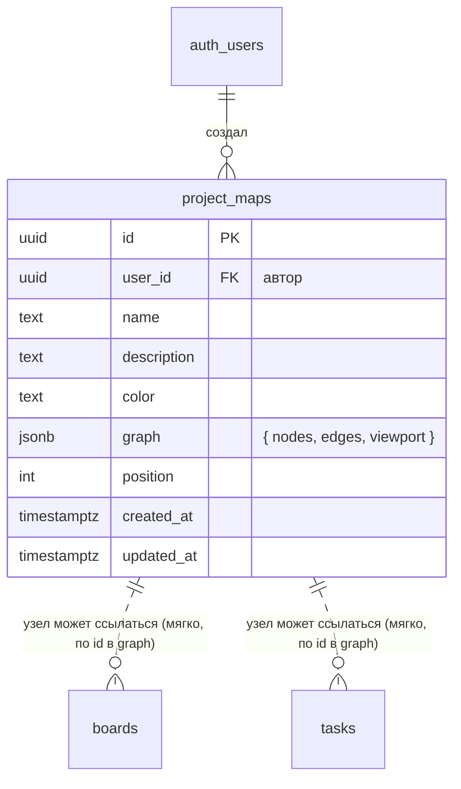
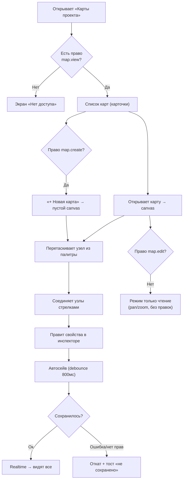
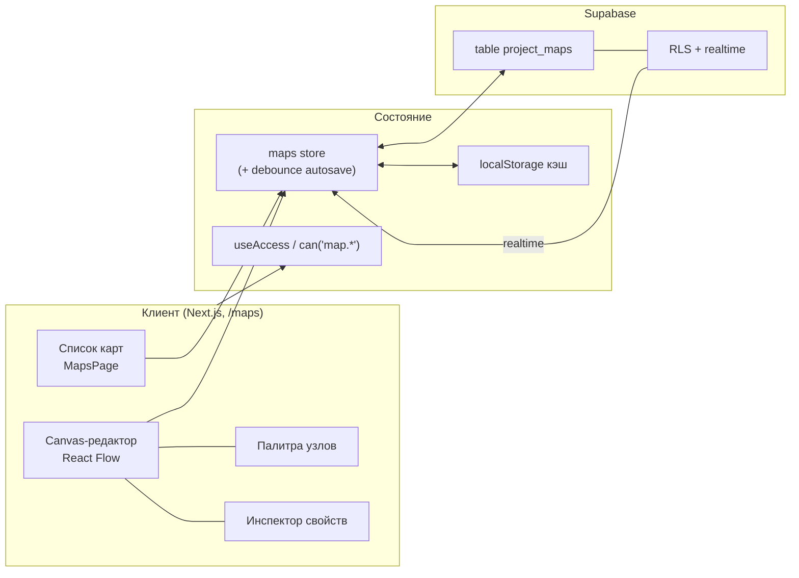

# Карта проекта — визуальный конструктор флоу · Дизайн

> Документ проектирования. Кода нет — сначала согласуем логику, потом строим.

## 1. Проблема (переформулировка)

Пользователю нужно место, где он **своими руками рисует структуру проекта**: узлы (экраны,
действия, решения, процессы) и связи между ними — чтобы видеть флоу целиком и обсуждать его с
командой. По сути это **встроенный редактор блок-схем / user-flow**, живущий рядом с досками и
задачами Bulut, а не отдельное приложение.

«Универсальный конструктор» = набор готовых типов узлов + свободные связи + палитра, из которых
можно собрать любую схему (user flow, архитектура, процесс, roadmap).

**Кому служит:** владельцу/команде — как единая визуальная карта проекта.
**Успех:** за 1–2 минуты создать карту, накидать узлы, соединить стрелками, и это сразу видят все
(с учётом прав), как и остальные данные в общем воркспейсе.

## 2. Рекомендуемый подход и почему

**Canvas на библиотеке [React Flow (`@xyflow/react`)](https://reactflow.dev)** + хранение графа
одной строкой **JSONB** в Supabase + автосейв с debounce + realtime, как в остальном приложении.
Права — новая группа `map.*` в существующем каталоге прав.

Почему React Flow: это стандарт для node-based редакторов в React (drag, соединения, zoom/pan,
minimap, кастомные узлы «из коробки», MIT, работает с React 18). Мы получаем 80% «конструктора»
бесплатно и пишем только свои типы узлов и панель свойств.

Альтернативы (отклонены, 1 строкой каждая):
- **Свой SVG/Canvas с нуля** — месяцы работы на то, что React Flow уже решил.
- **tldraw / Excalidraw** — это «белая доска» для рисунка от руки, а нам нужны структурированные
  узлы+связи с данными, а не скетч.
- **Отдельные таблицы `nodes`/`edges`** вместо JSONB — гранулярнее, но сложнее и не нужно для MVP
  (см. §5 и §9).

**Ключевой компромисс:** JSONB-хранение = простой автосейв и мгновенная загрузка, но правки —
по принципу «последний победил» (см. §10). Для внутренней команды это приемлемо; полноценное
совместное редактирование выносим в фазу 3.

## 3. Контекст (как ложится на существующий Bulut)

Проект уже даёт все нужные паттерны — переиспользуем, ничего нового не изобретаем:

| Что нужно | Что уже есть в Bulut | Как используем |
|---|---|---|
| Список сущностей + страница-редактор | `boards` → `/` и `/board/[id]` | Зеркалим: `/maps` (список) и `/maps/[id]` (canvas) |
| Хранилище + realtime + оффлайн-кэш | `store.tsx`, `db.ts`, `cache.ts` | Добавляем карты в тот же store либо отдельный лёгкий стор |
| RLS в общем воркспейсе | миграции `boards/tasks` (`auth.uid() is not null`) | Такая же политика для `project_maps` |
| Система прав + гейтинг | `permissions.ts`, `access.tsx`, `RequirePerm` | Новая группа прав `map.*`, пункт в Sidebar |
| Выбор исполнителя, темы, UI-кит | `AssigneePicker`, токены в `globals.css`, `Modal` | Узлы могут ссылаться на исполнителя/доску/задачу |

Новая зависимость: `@xyflow/react` (~ainsingle пакет, tree-shakeable). Больше ничего.

## 4. Актёры и роли

Встраиваемся в текущую модель `owner / admin / member` и добавляем права:

| Право | Что даёт |
|---|---|
| `map.view` | Видеть раздел «Карты проекта» и открывать карты |
| `map.create` | Создавать новые карты |
| `map.edit` | Двигать/добавлять/удалять узлы и связи, менять свойства |
| `map.delete` | Удалять карты целиком |
| `map.export` | Экспорт карты (PNG/JSON) |

owner/admin — все права автоматически (как сейчас). Обычный пользователь без `map.edit` видит
карту в **режиме только для чтения** (canvas залочен: pan/zoom можно, редактировать нельзя).

## 5. Модель данных

Одна таблица. Весь граф — в `graph` (JSONB): узлы, связи и положение вьюпорта. Это ровно та форма,
которую React Flow отдаёт и принимает, — сохранение/загрузка без маппинга.



**Форма `graph` (внутри JSONB):**

```
graph = {
  nodes: [
    { id, type,               // тип кастомного узла (см. ниже)
      position: { x, y },
      data: { title, description, color, icon,
              link?: { boardId?, taskId?, url? },   // опциональная привязка
              assignee?, status? } }
  ],
  edges: [
    { id, source, target, label?, type?, animated?, markerEnd }
  ],
  viewport: { x, y, zoom }
}
```

Связи с `boards`/`tasks` — **мягкие** (просто id внутри JSONB, без FK). Если доска/задача удалена,
узел не ломается — показываем «источник удалён» (см. §10).

**RLS** (как у досок, общий воркспейс):
- `select` — любой авторизованный;
- `insert` — `user_id = auth.uid()`;
- `update` / `delete` — любой авторизованный (реальная защита — гейтинг по `map.edit`/`map.delete`
  на клиенте, как уже сделано для карточек).

## 6. Типы узлов и связей (сам «конструктор»)

Палитра типов узлов — это и есть универсальность. Стартовый набор:

| Тип | Вид | Назначение |
|---|---|---|
| `terminator` | капсула | Начало / конец флоу |
| `screen` | прямоугольник с иконкой | Экран / страница |
| `action` | прямоугольник | Действие пользователя/системы |
| `decision` | ромб | Ветвление (да/нет) |
| `process` | прямоугольник со скруглением | Процесс / шаг |
| `note` | стикер | Заметка/комментарий на холсте |
| `group` | контейнер | Рамка-группа (этап, зона) |
| `link` | карточка | Ссылка на **доску/задачу Bulut** или URL |

Каждый узел: заголовок, описание, цвет, иконка. Связи: обычная стрелка, пунктир, с подписью,
«анимированная» (поток). Этого набора хватает для user-flow, архитектуры и процессов.

## 7. Пользовательский поток (основной путь + ошибки)



Шагов до результата: **открыть → создать → бросить узел → соединить = 4**. Быстро.

## 8. Архитектура



Всё зеркалит существующий поток «boards»: та же связка store ↔ db ↔ Supabase ↔ realtime ↔ cache,
плюс проверки прав через уже готовый `useAccess`.

## 9. Проверка на простоту — что сознательно НЕ делаем в MVP

- **Не заводим таблицы `nodes`/`edges`** — граф в одном JSONB. Меньше кода, атомарное сохранение.
  Мигрируем на отдельные таблицы, только если карты вырастут до сотен узлов и понадобится
  гранулярный realtime.
- **Не делаем CRDT/совместное редактирование** — MVP «последний победил» + realtime-перезагрузка.
- **Не делаем версии/историю** — позже, если попросят.
- **Не делаем исполняемую логику** — это схема (диаграмма), а не движок процессов.
- **Не пишем свой canvas** — берём React Flow.
- **Автолэйаут, экспорт PNG, шаблоны** — фаза 2, не блокируют запуск.

## 10. Что может пойти не так (pre-mortem)

| Риск | Поведение по задумке |
|---|---|
| Двое правят одну карту одновременно (JSONB last-write-wins) | Realtime перезагружает карту, если у тебя нет несохранённых правок; если есть — не затираем, показываем «карта изменена, обновить?». Полный мёрдж — фаза 3. |
| Ошибка/нет прав при сохранении | Откат к последнему сохранённому состоянию + тост «не сохранено». |
| Автосейв гонится с загрузкой | Сейв включается только после `ready`; пока грузим — не пишем. |
| Узел ссылается на удалённую доску/задачу | Мягкая ссылка: показываем «источник удалён», узел живёт. |
| Оффлайн | Пишем в localStorage-кэш, синхроним при возврате сети (как уже делает store). |
| Очень большой граф (сотни узлов) | React Flow тянет; JSONB — до разумного размера. При росте — переход на таблицы nodes/edges (фаза 3). |
| Пользователь без `map.edit` пытается тащить узел | Canvas в режиме `nodesDraggable=false`, кнопки скрыты (как гейтинг карточек). |

## 11. Открытые вопросы / решения (нужен твой ввод)

1. **Привязка к доскам/задачам — ✅ РЕШЕНО: сразу в MVP.** Узел `link` умеет ссылаться на доску
   или задачу Bulut уже в фазе 1: пикер выбирает доску/задачу из данных, которые и так лежат в
   store; клик по узлу открывает `/board/[id]?task=…`; если источник удалён — узел показывает
   «источник удалён», но не ломается (мягкая ссылка по id в JSONB).
2. **Экспорт (PNG/JSON) — в MVP или фаза 2?**
   ✅ *Рекомендую:* фаза 2. Ценность холста — в редактировании, экспорт добавим быстро потом.
3. **Хранение — JSONB (рекомендую) или отдельные таблицы сразу?** ✅ JSONB для MVP.

---

## Фазы реализации

- **Фаза 1 — MVP (ядро конструктора):** миграция `project_maps` + RLS; права `map.*` в каталог и
  админку; пункт «Карты проекта» в Sidebar (по праву); страница списка `/maps` (создать/переименовать/
  удалить); canvas `/maps/[id]` на React Flow — палитра из 5–6 типов узлов **+ узел-ссылка на
  доску/задачу** (пикер + переход по клику), связи-стрелки, инспектор свойств, автосейв + realtime,
  режим «только чтение» без `map.edit`.
- **Фаза 2 — удобство:** экспорт PNG/JSON; автолэйаут (dagre); дублирование карты; шаблоны
  (готовые заготовки флоу); библиотека цветов/иконок.
- **Фаза 3 — командная работа:** совместное редактирование (курсоры), комментарии на узлах,
  версии/снимки, «создать задачу из узла», при росте — таблицы `nodes`/`edges`.

**Оценка фазы 1:** сопоставима с одним крупным разделом (журнал/отчёты) — делается за один заход.

> Посмотри и скажи: подтверждаешь подход (React Flow + JSONB + права `map.*`) и решения из §11 —
> тогда начинаю с Фазы 1.
